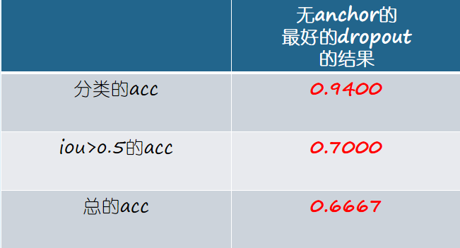
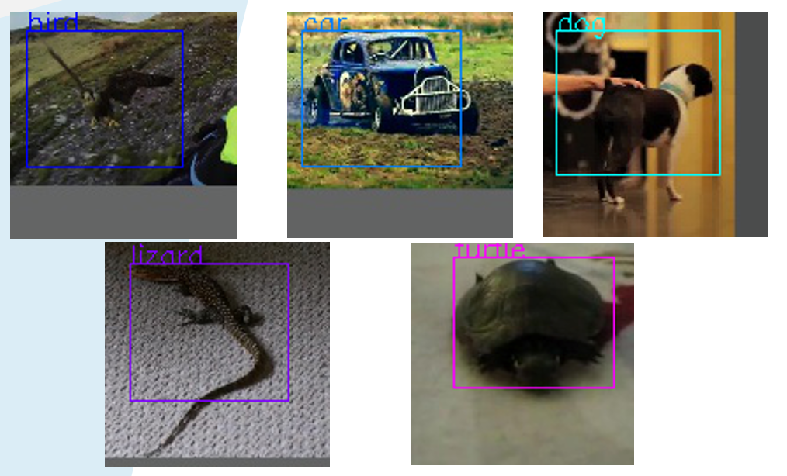

# Object Localization via CNN

## with anchor method
The .py file with name "with_anchor" is the algorithm which uses anchor to let the model learn the offset of bounding boxes.

You can compare them with the original algorithm and codes without anchors.
## Task and Dataset Info

>- Object localization using CNN 
>- Data: In each image, there is just one object. We just need to localize the only object in the image. If you are interested in multi-object detection(object detection field),you can modify my code to reach your goal.
>- Evaluation metric: A correct localization means the predict class label is correct and the predict box has an loU>0.5 with the ground- truth. 
>- implementing the localization network using direct bbox regression 

**Because this is an experiment of 《Foundation of Computer Vision》class which is hosted by Prof.Xinggang Wang and Prof.Zhenyu Liao in Huazhong University of Science and Technology.** So I think that I don't have the privilege to make the dataset opensource. So I just introduce the feature of the data **which is said above.**

## some dataset info
data: image with only one object inside

label: the class info

bbox: the  (xmin,ymin,xmax,ymax) bounding box coordinate
## Result

